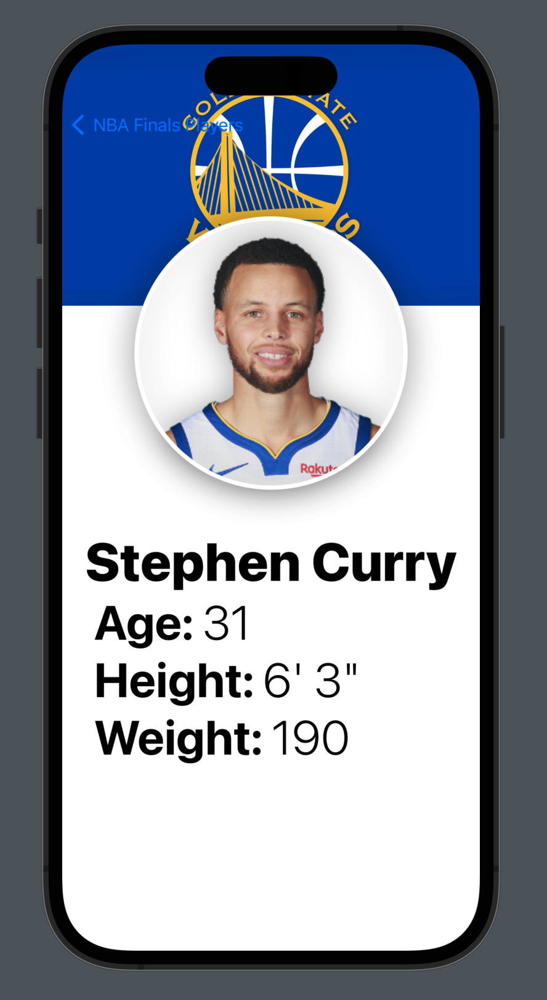
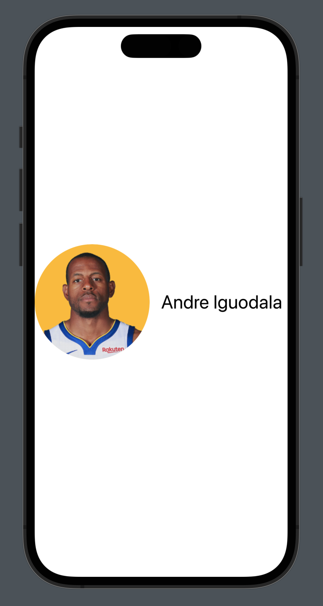
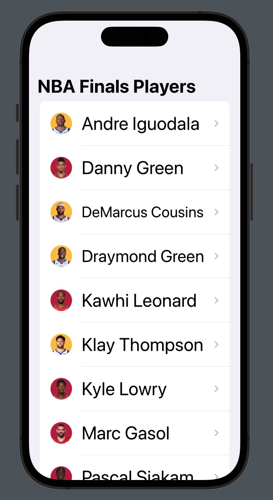

# NBA Players - Swift UI Project

Basic Swift UI project to get familiar with the new Swift UI Framework.

Focus on understanding the new approach on how to work with SwiftUI compared with UIKit.

Usage of common UI elements like List, NavigationView, Text, Image, etc.

Review of the new XCode functionalities related with preview and live preview.

